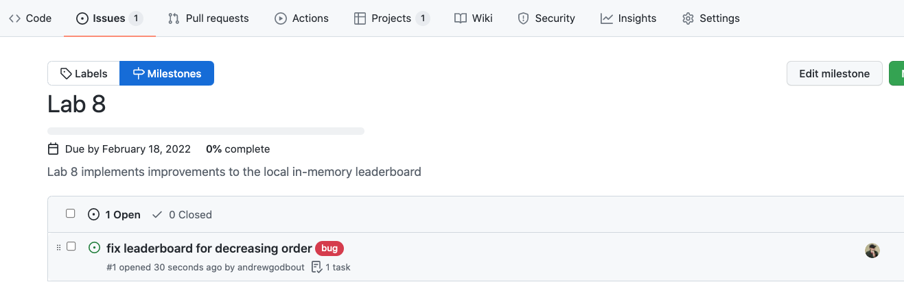
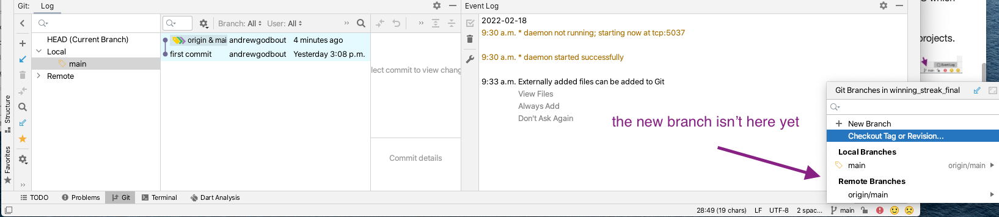

# Lab 8
## Collaborating in a Github repository

**required reading**
[Github flow](https://docs.github.com/en/get-started/quickstart/github-flow)


In this lab we look at how to share a git repository with others, including fixing a merge conflict. We practice a proposed branch and merge *flow* that you are recommended to follow in your group project repository and we introduce the github project kanban board. The kanban board will be central to your repository checkin requirement for your group project - and could be central to your group's success.

We will simulate team-work in this lab by having you do some commit and pushes to Github from multiple branches. You could always find a partner for the lab if you wanted but the lab is designed as an individual task.


**Note:** Reminder that there is a grading deliverable around improving the winning streak app. Here is a Road Map of what is left in the app (existing labs):

  - today: in-memory high score tracking is added
    - you are responsible for reading/understanding the code as it is mostly a repeat of skills we have already developed
  - after spring break:
    - local database to make the local high score persistant
      - sql-lite and hive dbs discussed
    - cloud connected database to make the global high score list work
      - a simple but insecure redis direct connection and firebase are both discussed
    - other potential lab topics (not yet finalized)
      - WorkManager - doing things on a schedule in the background
      - intents (passing information to other apps and receiving information from other apps).

There is significant opportunity to improve the Navigation in the app. After today there are not planned many changes to the look of existing screens. Therefore this presents some opportunity.

<details> <summary>Suggestions for improving the app: </summary>
<p>
<br>

- significant contributions to testing
  - almost none of our code is tested
  - you will have to do lots of testing in your group projects
  - this presents an opportunity for skill Development while improving the app

- screen flow and Navigation  
  - the routes leading to Answered Questions are clunky at best
- look and feel
  - aside from *green* there isn't anything too distinguishable in the app
  - most of the pages look underwhelming

- the initials for high scores will be left as randomly generated
 - coming up with how and where to allow the user to input initials is required if the app is ever released in some wide spread way
    -  SharedPreferences are a great spot to save initials
    -  a dialog box allowing user to input initials if a high score is achieved ... another idea

- Logos, splash page and other image or font assets

- Sharing high scores with friends via SMS or other mechanism

- Notifying users of new high scores

- fixing formatting of the questions

- making use of the category somehow in the question display

- incorporating timers to allow limited time to select answers before it is considered incorrect

- ability to monitor the high scores while on an active streak
  - leave the active streak and return to same spot

- tracking users long term performance (questions answered correctly out of total questions)
  - do users perform well is specific categories? top 10 categories where the user has attempted at least 2 questions,etc

- dark mode theme

- custom high score list with only certain initials
  - compare just against friends

- sports or movie mode
  - just questions from specific categories related to certain topics like sports, geography or movies, etc

- Any modifications of your choosing

</p><br>
</details>

## Today's lab

 - [ ] Create a kanban style project board
      - Template: Automated kanban
      - the repository has a sample project board included (but you should go through the process of making your own)

**Create a project board**

- Within the Github repository for this lab, click on Projects and then select the non-beta version of Projects and click `New Project`:


- Create a new project using the `Automated kanban` Template


- Open the new project board and take a look.

  - by default there are 3 categories:
    - **To do**: work items that are planned but not yet started
    - **In progress**: work items that someone is actively working on
    - **Done**: completed work items

    - (you can read or ignore or delete the default cards that are populated in your project board)

**Clone the repository and inspect the code**

 - [ ] Clone the repository to your local machine
 - [ ] Open the project with Android Studio
 - [ ] Inspect the code
    - [ ] Notice changes to `HighScoreView` and a new `Cubit/state` to keep track of high scores.

 - [ ] Play the game, notice a few issues:
    - [ ] the high scores are in ascending order (lowest at the top)
    - [ ] their are only 5 scores maximum on the scoreboard

**Open Github issues to track the winning streak improvements**

 - [ ] go back to the Github repository for this lab
 - [ ] create a Lab 8 milestone

Under the issues tab select `milestones` and then create a milestone to track all of the work for lab 8.

 

 

 - [ ] Create 2 Github issues
    - [ ] Fix leaderboard to be in descending order
    - [ ] lengthen the scoreboard to include 10 total high scores


Ensure you notice the right sidebar. Assign the issue to yourself, label the issue appropriately (bug or feature for example). Assign the issue to your new project, and new lab 8 milestone. Don't forget to Submit new issue.


If you navigate to the project board or to the Lab 8 milestone you'll see the new issue has shown up.




*Note:* The example images above show only 1 issue. You should ensure at this point you have created 2 issues. One a bug for fixing the direction of the leaderboard and a feature to extend the length of the leaderboard to 10 (from 5).


## Github flow

Flow is a software development term short for workflow. It involves the steps you should undertake to complete a work task.

When working in a shared repository many people may be updating the code at any point. Everyone needs to be mindful not to overwrite someone else's changes. Some simple workflow rules can help keep a repository organized and operational.

See for example the official Github Flow guide:

[Github flow](https://docs.github.com/en/get-started/quickstart/github-flow)

Here are the expectations for completing work tasks in a shared repository (for this course):

- [ ] Find some issue to work on / or open a new issue for your task
- [ ] Move the issue into the in-progress category in the project board (this tells everyone what you are currently working on)
- [ ] Create a branch where you will git commit your work
- [ ] Checkout the branch
- [ ] Implement and test your solution
- [ ] Check the code into the branch (commit and push)
- [ ] open a pull-request to merge your branch into the main development branch for your project

That seems like a lot of work but it will become second nature before too long. **An important distinction to make is that contributing to an individual repository is totally different than working in a shared repository with others**. This workflow only applies / makes sense if multiple people are sharing the same repository.

Let's go through the process now (don't worry if there are some terms you aren't yet comfortable with like pull-requests for example).

### move the issue into in-progress

- anything in-progress signals to your team what you are actively working on.

go to the project kanban board and move the issue for leaderboard should be descending into the in-progress state (just drag it over).


### Branches


*image source: https://www.atlassian.com/git/tutorials/using-branches*

A branch allows you to split from another branch at a particular point in time (maybe like main as shown in the image). You can then modify this existing branch without effecting the branch from which you split, i.e., you can commit code and make other branches, merge them, etc.

In a shared repository this is useful because it allows you to `freeze` the codebase at the point when you started working on something (when you made the new branch), implement your fix or feature and test it all without worrying about people making changes that might impact your solution.

Eventually you have to merge your solution back into the original code branch but you won't end up in a situation where in the middle of your solution you have to integrate (or merge) your code with someone else's commit. You can work in a more relaxed environment knowing your branch is under your control.

*Note: in many instances multiple people would work on the same fix or branch but they would know about each other and presumably be working together in some manner.*

*You can read more about branches in the source link for the branching picture above.*

 - [ ] create a new branch


From the `<> Code` link in the repository click the drop down indicating `main` and give your new branch a name. This branch is where we are going to work on our descending leaderboard fix.

Typically work teams determine some rules for how branches are named. Maybe they include the intended milestone or the person who is doing the fix, etc. Your project team might want to have their own rules for this. Personally I like to have my name or initials in branches that I will work on (it makes it easier in big projects to find and reference those branches later on).

**check-out the branch in Android Studio**

Android Studio should recognize the project as using git version control (if not something went wrong with your cloning process (you likely do not want to have to enable VCS which turns a project into a new git repository))

In the bottom right you'll see the branch you are currently operating on for any git projects.


You might need to fetch the new branches for your project to receive the information about the new branch we just created. If you followed this lab exactly then you cloned the repository before you created the new branch.




After clicking the fetch icon you should see your branch show up in the `Git` bottom window panel. Also if you open and close the bottom right branch indicator you should see the new branch show up there.

**Note the difference between Local and Remote*: Remote is what is on the server (github) local is what is on your current machine. From now on you will want to **pay close attention to what branch you are working in on your local machine.** In the above picture we see that there are two remote branches (main and ag...) and locally we are working on main.

**Checkout the branch you created in github**

Select the Remote branch with the name you gave, right click and select checkout.


Verify that you are now working on that new branch.


## fix the leaderboard

- [ ] update the leaderboard so it sorts in descending as opposed to ascending order

Navigate to `lib/high_score/cubit/local_high_score_cubit.dart`

Around line 49 change the sorting to sort descending as opposed to ascending (don't forget to update the comments near that code fix as well.)

<details><summary>hint: fixed code </summary>

<br><p>

```dart
//descending order
leaders.sort((a,b)=>b.compareTo(a));

```

<br></p>
</details>

- commit and push the code to GitHub on your new branch (not main).


Navigate to Github and verify your branch changes have shown up.


## Pause on the Leaderboard ascending fix at the moment.

*normally you would proceed to compare and pull-request (i.e., merge this into the main branch), but we are going to simulate some team work here. So hold off on the merge*

## Work on the scoreboard length issues

- we should have two open issues at the moment:

  - length of the leaderboard issue, and
  - descending / ascending issue.

- [ ] Move the length of leaderboard issue into in-progress state in the kanban board


- [ ] create new branch where your fix for this issue will go


- [ ] in github switch to this issue (it likely happened automatically)


You can verify that your code fix you submitted for the descending leaderboard is **not** in this branch of the code base. This branch was a `snapshot` from the original main branch (which has had no changes made to it yet). *This is an important thing to recognize*.

## checkout the new branch in Android Studio


## fix the length to be 10

In the file: `lib/high_score/cubit/local_high_score_cubit` alter the isHighScore and updateScoreboard methods to handle 10 instead of 5 for the length of the scoreboard.

(basically change the 10's to 5' and it should be good).

- [ ] compile and run and make sure there is no issues.

- [ ] commit and push the changes


## Pull-requests

Our project now has two fixes that have gone into their own branches. But main is still sitting in its original state.

We need to merge those branches back into main (and then delete those old branches to keep our repository somewhat organized).

The process of merging branches together is called a pull-request in Github.

- [ ] create a pull-request for our lengthen scoreboard branch.


This is the easy pull-request because it will go directly into main (and no other code has been merged with main since we created this request).

- [ ] ensure to use the right pane to assign the request, give it a project, and milestone and label.

- [ ] use the `fixes` keyword to followed by a # to ensure this pull-request will link to the appropriate issue (and it will close the issue automatically for us).


- [ ] On the next page select `Merge Pull Request`.


- [ ] delete the old branch to keep the repository uncluttered


- [ ] Navigate to the kanban board to see that the issue (and pull-request) have migrated automatically to the `Done` date.

- [ ] Navigate to the milestone to see that our progress on Lab 8 is automatically updated.

**Congratulations you have completed a branch and merge fix in Github**

## Merge the other branch

- [ ] Open a pull request to merge the other branch into main

- [ ] This is risky business because we have already updated main but now we are merging new code in.

  - [ ] there is a high chance of breaking code or other here
  - [ ] Github indicates it is able to merge but you should be careful here. You might want to do the merge manually in android studio and then run your tests and ensure everything builds and passes tests before merging this into main.

  - [ ] for now let github do the merge for you (don't forget to delete the old branch).

*The above note regarding the risks involved in automatically merging is a critical point to keep in mind on your projects*.


- [ ] Check the project board to see everything is Done
- [ ] Check the Milestone to see that Lab 8 is complete.


Last notes: regarding this lab and your projects. **You are expected to follow this workflow for your projects and expected to maintain a kanban project board**. Each time you add work/code/files to your project it should happen on its own branch (with an associated issue) then the issue can be closed by the pull-request and subsequent branch deleted.


*Congratulations on completing Lab 08* 
